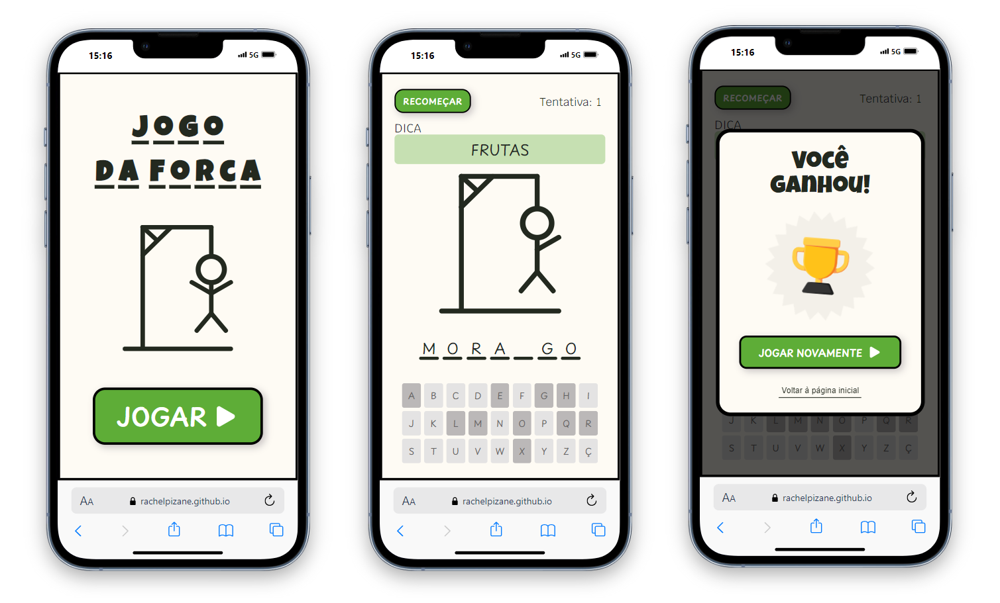
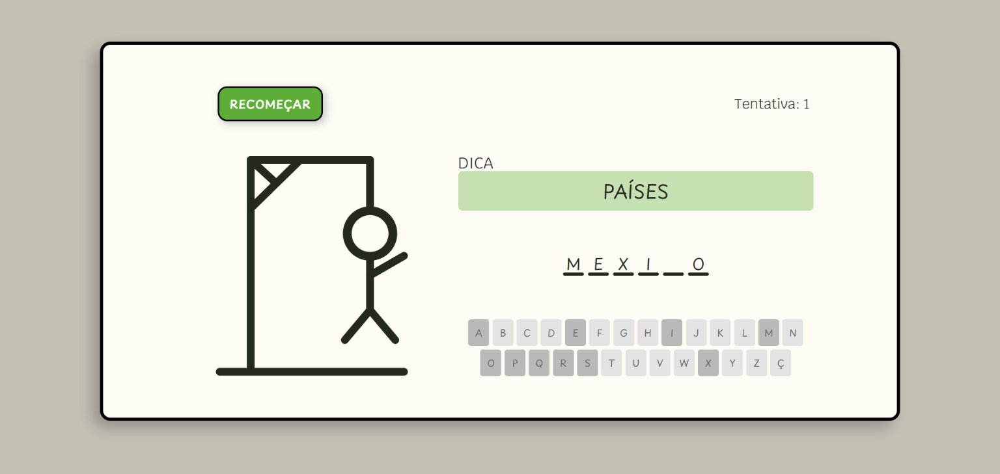
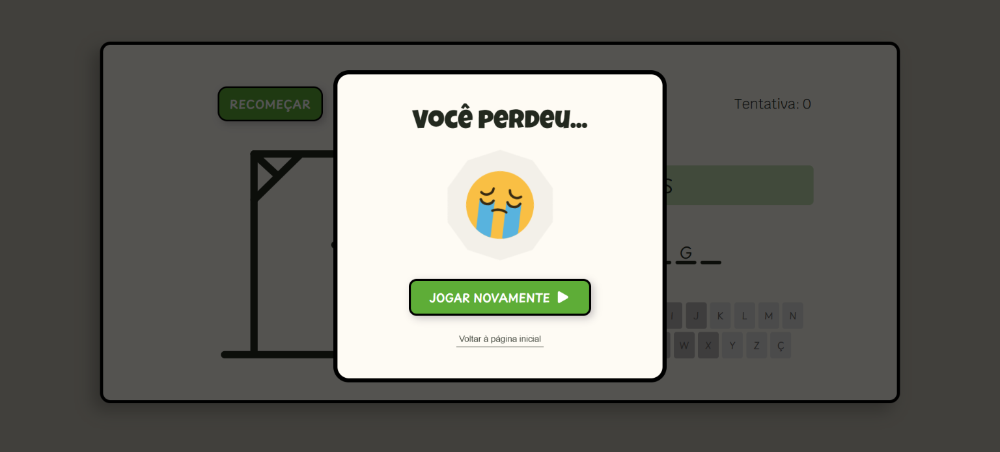

# Jogo da Forca

## 1. Descrição 📝

Este projeto é um jogo de adivinhação de palavras onde o jogador tenta descobrir a palavra secreta escolhida pelo sistema, adivinhando letras dentro de um número limitado de tentativas.

O objetivo deste repositório é aplicar e consolidar funcionalidades aprendidas na aula de "Interatividade em Páginas Web" do Instituto Infnet.
 

## 2. Status do projeto 🕜

Concluído!
 

## 3. Link 🔗

- Live Site URL: [GitHub Page - Jogo da Forca](https://rachelpizane.github.io/jogo-da-forca/)
 

## 4. Funcionalidades ⚙️

Em construção 🛠️
 

## 5. Tecnologias utilizadas 🔧
 
 Em construção 🛠️
  

 ## 6. Screenshot 📸

 
